# Resizer

Resizer is free, open-source application that allows you to set and maintain a specified window size for an application in Windows OS.
- [About](#about)
- [GUI usage](#GUI)
- [Build](#build)

## About

Resizer is app for Windows OS that uses Windows API calls to set the window size of selected application. Moreover, it has an option to set the grid on which the windows will be placed and move or replace windows between grid cells.

## GUI

  
<b>How to add new process for processing its windows?</b>

    On the main screen, select a <i>Window settings</i> tab and press 1. 
    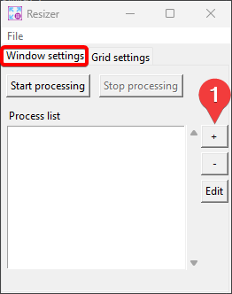 
    After that a window will open in which you need to fill in. The <i>Use coordinates?</i> flag indicates whether all windows of this process should open in the given coordinates or not. 
    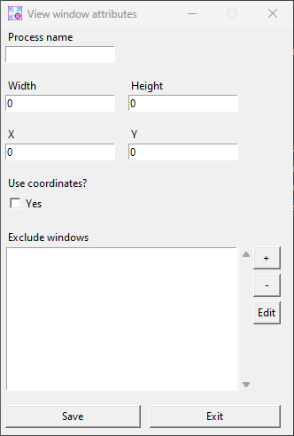 
    After you have filled out this window, <b>make sure</b> to click the <b>Save</b> button or nothing will be saved.

  
<b>How to edit process windows attributes or cell coordinates?</b>

    To edit the attributes of a process window or coordinates of cell, you must select it from the list. Then double-click on it or click on the <i>Edit</i> button (1 on the screenshot). 
    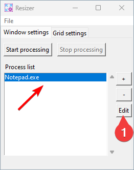 
    After that, a window will open where you can edit attributes of a process window.

  
<b>How to add process window names to be ignored?</b>

    You can do this when adding new process for processing its windows or editing a selected process windows attributes. To do this, in the window for editing the process window attributes, press on 1. 
    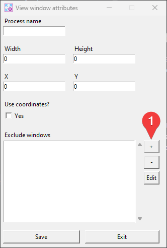 
    This will open a window where you need to enter the <b>exact</b> name of the window you want to ignore. 
    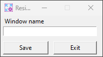 
    After you have filled out this window, <b>make sure</b> to click the <b>Save</b> button or nothing will be saved. Also, don't forget to save the attributes of the process window.

  
<b>How do you use grid layout?</b>

    In the program you can set the grid layout for the windows of the processed processes. 
    For this, on the main screen, select a <i>Grid settings</i> tab and enable the <i>Use grid?</i> flag. Note that this method has a higher priority than using coordinates in the process window attributes. 
    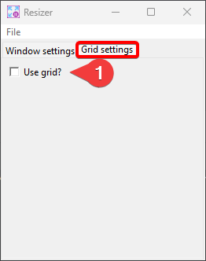 
    After that, you will have an area that shows the cells of the grid. 
    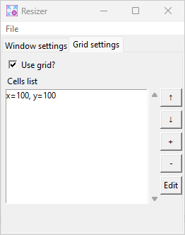 

  
<b>How to add a new cell to a grid?</b>

    When using grid layout, you can add a new cell using the button 1. 
    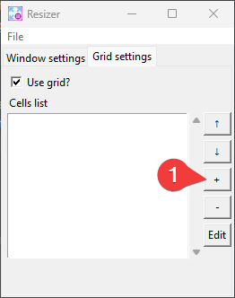 
    After that, the window for filling in the cell coordinates will open. 
    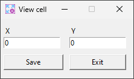 
    Accordingly, the upper left corners of the processed process windows will be located in the entered cell coordinates.

  
<b>How to change the grid cell priority?</b>

    The process windows are placed in the cell in the order in which they appear in the list. That is, the windows will be placed in cell 1 first, followed by cell 2, and so on. 
    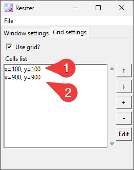 
    To change the priority of a cell, select it. If you want to increase the priority, press button 1, otherwise press button 2.
    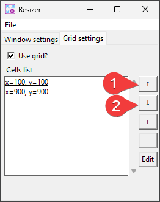 

  
<b>How to save the settings?</b>

    To save the settings, you must select <i>File->Save</i> from the top menu. 
    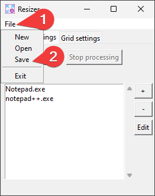 
    After that, a window will open where you will need to specify the locations and file names. The default settings file is named

  
<b>How to exit?</b>

    The standard program closing logic is overridden to minimize the program. So, to exit the program, you must either select <i>Exit</i> from the minimized application menu or select <i>File->Exit</i> from the top menu when the program is shown. 
    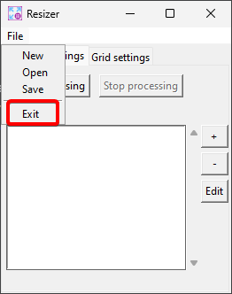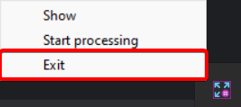

## Build

Tested for **python 3.10**

1. Clone the repository: `git clone https://github.com/nickvolen/resizer.git`.
2. Install dependencies `pip intall -r requirements.txt`
3. Build application `pyintaller --distpath <DIST_PATH> resizer_gui.spec`

You can use the console version of the application, but all settings will have to be done manually in the settings.yaml file, which is there by default as a template.

To build the console version, you need to follow steps 1-2 from the previous step and `pyintaller --distpath <DIST_PATH> resizer.spec`